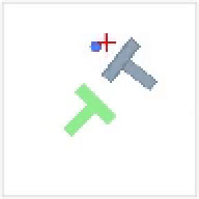
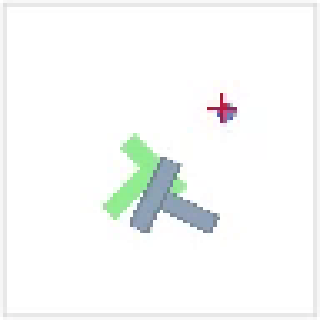
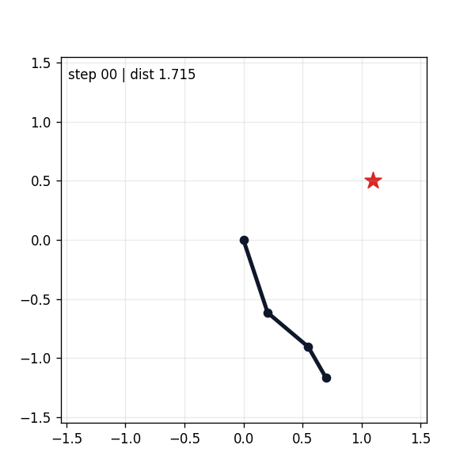

# iMeanFlow Robotics

iMeanFlow Robotics is a compact robot imitation-learning project for **few-step
action chunk generation**. It implements a no-CFG conditional iMeanFlow policy
and evaluates it on robotic arm reaching / pushing demos and low-dimensional
Push-T rollouts.

The project connects three ideas:

- flow matching for action generation,
- Mean Flow / iMeanFlow for few-step generation,
- action chunking for robotic imitation learning.

The core implementation is intentionally lightweight, while the Push-T result is
evaluated with a Diffusion Policy-style low-dimensional benchmark pipeline.

## Overview

Diffusion-style robot policies generate an action chunk by iteratively
transforming Gaussian noise into future actions. Flow Matching simplifies the
training target into a velocity prediction problem, but still commonly uses a
multi-step sampler.

iMeanFlow trains the policy to support larger time jumps. The intended benefit is
lower inference latency:

```text
generate an action chunk with 1-2 model evaluations
instead of a longer multi-step sampler
```

This is useful for robot control loops where action generation must run
repeatedly under a real-time budget.

## Architecture

```text
Observation history / robot state
        |
        v
Condition encoder
        |
        v
Noisy action chunk z_t = (1 - t) * action + t * noise
        |
        v
iMeanFlow policy network
        |
        +--> u(z_t, h, obs): interval-average velocity
        |
        +--> v_hat(z_t, h, obs): auxiliary instantaneous velocity
        |
        v
Few-step sampler
        |
        v
Future action chunk [a_t, ..., a_{t+k}]
```

## Policy Variants

| Policy | Description | Status |
| --- | --- | --- |
| `imeanflow` | No-CFG conditional iMeanFlow with `u` / `v` heads and few-step sampling | implemented |
| `flow_matching` | Conditional Flow Matching baseline in the companion FlowPolicy benchmark | evaluated |
| `diffusion_policy` | Original denoising diffusion policy baseline used as the framework reference | reference only |

## Current iMeanFlow Results

The uploaded results are from the current **no-CFG iMeanFlow** training and
evaluation run on low-dimensional Push-T.

| Method | NFE | Test seeds | Test mean score | Train mean score |
| --- | ---: | ---: | ---: | ---: |
| iMeanFlow lowdim Push-T | 2 | 50 | 0.614 | 0.544 |



The full evaluation artifacts are included in the repository:

- Evaluation log: [eval_outputs/eval_log.json](eval_outputs/eval_log.json)
- Simulation rollout videos: [eval_outputs/media](eval_outputs/media)
- Real-world / hardware video: [assets/shiji.mp4](assets/shiji.mp4)


## Flow Matching Baseline Result

The companion FlowPolicy baseline replaces Diffusion Policy's denoising
objective with a Flow Matching velocity objective while keeping the original
low-dimensional Push-T data, rollout, and evaluation pipeline. A successful
evaluation rollout is shown below:

| Method | Sampler | Test seeds | Test mean score |
| --- | --- | ---: | ---: |
| Flow Matching lowdim Push-T | multi-step Euler | 50 | 0.818 |



## Method Overview

For a demonstrated action chunk `x` and Gaussian noise `e`:

```text
z_t = (1 - t) * x + t * e
v_target = e - x
```

The model predicts:

```text
u(z_t, h, obs)      # interval-average velocity
v_hat(z_t, h, obs)  # auxiliary instantaneous velocity
h = t - r
```

The iMeanFlow training target is built with a Jacobian-vector product:

```text
v_tangent = v_hat(z_t, h=0, obs)
dudt = JVP(u, direction=(v_tangent, dt=1, dr=0))
V = u + (t - r) * stopgrad(dudt)
loss = ||V - v_target||^2 + ||v_hat - v_target||^2
```

At inference time:

```text
z ~ N(0, I)
for t -> r:
    z = z - (t - r) * u(z, t-r, obs)
```

The default sampler uses two Euler steps.

## Why No CFG

Classifier-free guidance is important in many image-generation systems, but it
requires an unconditional branch and condition dropout. Robot action generation is
already strongly conditioned by robot state, task, and visual observations. A fake
`omega` parameter without unconditional training would be misleading, so this
project uses direct conditional generation only.

## Repository Structure

```text
src/imeanflow_robotics/
  config.py          # model and training configuration
  model.py           # observation-conditioned Transformer with u/v heads
  policy.py          # iMeanFlow loss and few-step action sampling
  data.py            # synthetic robotic arm dataset
  sim.py             # lightweight 2D planar-arm simulation
  sim3d.py           # generated 3D reaching demonstrations
  train.py           # training entry point
  evaluate.py        # checkpoint evaluation

scripts/
  train_synthetic.py
  rollout_demo.py
  sim_demo.py
  mujoco_3d_demo.py
  franka_push_block_viewer.py

docs/
  method.md
  interview_guide_zh.md

tests/
  test_policy.py
```

## Installation

Clone the repository and install the development dependencies:

```bash
git clone https://github.com/DeepforThink/imeanflow-robot-arm.git
cd imeanflow-robot-arm
pip install -e ".[dev]"
```

For MuJoCo demos, install the optional MuJoCo dependencies:

```bash
pip install -e ".[mujoco]"
```

## Quick Start

### 1. Run Unit Tests

```bash
pytest -q
```

### 2. Train the Lightweight iMeanFlow Policy

```bash
python scripts/train_synthetic.py --steps 800
```

### 3. Evaluate a Checkpoint

```bash
python -m imeanflow_robotics.evaluate --checkpoint checkpoints/imeanflow_synthetic.pt
```

### 4. Run a Minimal Action-Queue Demo

```bash
python scripts/rollout_demo.py
```

## Simulation Demos

### Planar Arm

```bash
python scripts/sim_demo.py --train-steps 300
```

The demo trains a small no-CFG iMeanFlow policy on generated reaching
demonstrations, rolls it out with receding-horizon action chunks, and writes:

```text
assets/planar_arm_demo.png
assets/planar_arm_demo.gif
```



The demo is a kinematic simulation, not a physics benchmark. Its purpose is to
show the policy generating action chunks that move a simple robot arm toward a
target. The default rollout uses 4 model evaluations per chunk and a fixed seed
for reproducible visualization. A small joint-step limiter is applied during
rollout, matching the kind of low-level command smoothing used in real robot
control loops.

### 3D MuJoCo Reaching

```bash
python scripts/mujoco_3d_demo.py --train-steps 1200
```

This trains a small 3-DoF yaw/shoulder/elbow reaching policy, then runs it in
MuJoCo with position actuators. The arm is mounted on a small pedestal so the
visualization looks like a table-mounted robot rather than a linkage lying on
the floor. The script writes:

```text
assets/mujoco_3d_demo.png
assets/mujoco_3d_demo.gif
```


### MuJoCo Push-Block Prototype

```bash
python scripts/mujoco_push_block_demo.py --save-data
python scripts/mujoco_push_block_viewer.py
```

The first command runs a scripted pushing episode, saves
`assets/push_block_scripted.png`, `assets/push_block_scripted.gif`, and optionally
`data/push_block_demo/episode_000.npz`. The second command opens an interactive
MuJoCo viewer. Keyboard controls in the terminal move the end-effector target so
the pushing setup can be inspected and tuned manually.

### Franka Panda Push-Block Viewer

```bash
python scripts/franka_push_block_viewer.py
```

This viewer loads the official MuJoCo Menagerie Franka Panda model through
`robot_descriptions`, then adds a tabletop block-pushing scene. It is the better
starting point for real robot-style experiments than the small hand-written
3-DoF arm above: the Panda has the full 7-DoF kinematic chain, gripper geometry,
joint limits, and collision meshes. Keyboard controls move a Cartesian wrist
target with damped least-squares IK:

```text
W/S: move wrist target +Y / -Y
A/D: move wrist target -X / +X
Q/E: move wrist target +Z / -Z
R: reset robot and block
P: print current state
```

## Usage

### Common Parameters

| Parameter | Example | Description |
| --- | --- | --- |
| `--steps` | `800` | Number of synthetic training steps |
| `--train-steps` | `1200` | Number of demo-specific training steps |
| `--checkpoint` | `checkpoints/imeanflow_synthetic.pt` | Checkpoint path for evaluation |
| `--save-data` | enabled flag | Save a scripted MuJoCo episode for later inspection |

### Recommended Workflow

1. Run the unit tests to validate the local environment.
2. Train the synthetic policy to verify the iMeanFlow loss and sampler.
3. Run the planar and MuJoCo demos to inspect action smoothness visually.
4. Use the FlowPolicy benchmark for quantitative Push-T comparison.
5. Move from simulation to Franka / real-world data only after the benchmark
   pipeline is reproducible.

## Example Code

```python
import torch
from imeanflow_robotics import IMeanFlowConfig, IMeanFlowPolicy

config = IMeanFlowConfig(obs_dim=9, action_dim=6, horizon=16, n_action_steps=8)
policy = IMeanFlowPolicy(config)

obs = torch.randn(4, config.obs_dim)
actions = torch.randn(4, config.horizon, config.action_dim)
loss, metrics = policy.compute_loss(obs, actions)

chunk = policy.sample_action_chunk(obs)
single_action = policy.select_action(obs[0])
```

## Real-Robot Notes

The current real-world video is included as a qualitative demonstration, not as a
claim of robust real-robot deployment. For a stronger real-robot experiment, the
recommended progression is:

1. Reproduce the Push-T benchmark evaluation with fixed seeds.
2. Validate action normalization, action horizon, and control frequency in
   simulation.
3. Collect executed robot states and actions, not only commanded actions, so the
   policy sees the behavior actually produced by the low-level controller.
4. Keep the action interface continuous where possible. For binary gripper
   commands, consider a separate head or post-processing rule.
5. Compare iMeanFlow against Flow Matching under the same data, environment,
   horizon, and evaluation seeds.

## What This Repository Is Honest About

This is a compact research/engineering implementation, not an official iMeanFlow
release and not a claim of state-of-the-art robot performance. The included
synthetic dataset exists to verify the training loop and sampling API. For real
robot use, replace `SyntheticArmDataset` with teleoperation or demonstration data
from your robot.

Recommended next experiments:

- compare 2-step iMeanFlow with 10-step Flow Matching,
- measure success rate and action smoothness on a real or simulated arm,
- add image/state encoders for visual imitation learning,
- benchmark control latency under different NFE values.

## References

- Lipman et al., Flow Matching for Generative Modeling.
- Geng et al., Mean Flows for One-step Generative Modeling.
- Geng et al., Improved Mean Flows: On the Challenges of Fastforward Generative Models.
- pi0 / OpenPI style action flow matching for robot policies.

## Acknowledgments

The Push-T benchmark setup follows the style of Diffusion Policy low-dimensional
evaluation. The README structure is influenced by recent robot-learning project
repositories that present an overview, architecture, runnable scripts, evaluation
artifacts, and real-robot notes in one place.

## License

MIT License.
